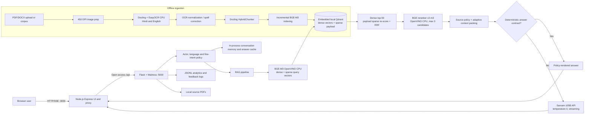
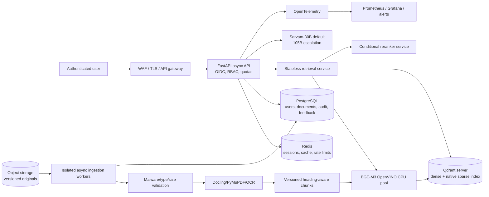

# Complete Technical Audit: CHiPS e-Procurement RAG Chatbot

**Audit date:** 26 July 2026  
**Target architecture:** CPU-only VM with Sarvam AI Chat Completions  
**Audited repository:** `E-PROC-CHATBOT_ANTI_GRAVITY`  
**Audit method:** Source review, configuration review, live health checks, corpus/index reconciliation, existing evaluation artifacts, targeted unit tests, and isolated CPU benchmarks.

**Evidence labels used throughout**

- **Measured:** Obtained from the repository, live application, saved benchmark output, or an audit command run on 26 July 2026.
- **Estimated:** Engineering estimate with its basis stated. It is not a measured service-level result.
- **Recommendation:** Proposed future state.
- Where evidence is unavailable, this report states exactly: **Information not provided.**

## 1. Executive Summary

The chatbot is an **advanced prototype / controlled-pilot system**, not an internet-facing production system. Its strongest areas are multilingual retrieval, procurement-specific intent routing, deterministic high-risk answer contracts, bounded Sarvam prompting, streaming, and an unusually broad set of evaluation suites. Its weakest areas are security, index lifecycle, independent generalization, observability, persistence, and horizontal scalability.

### Overall verdict

| Area | Verdict | Evidence |
|---|---|---|
| Functional architecture | Good prototype | Modular offline stages, BGE-M3 hybrid signals, Qdrant, cross-encoder reranking, policy routing, Sarvam streaming |
| CPU suitability | Good for low concurrency | OpenVINO CPU embedding/reranking; BGE-M3 query embedding averages 77 ms |
| Retrieval quality | Promising but inconsistent | Human-20 final-context source recall 72.5%; holdout-50 source recall 72%; tuned production-120 reports 100% |
| Answer generalization | Not yet proven | Holdout-50 has 11/50 full passes and 54.67% required-concept coverage |
| Latency | Acceptable for a pilot | Current generic Sarvam sample completed in 2.81-5.88 s; deterministic Human-20 P95 is 1.977 s |
| Scalability | Weak | Embedded Qdrant, in-process state/cache, serialized model infer locks, one Node/Flask unit |
| Security | Critical gaps | Open access, wildcard CORS, unauthenticated upload/indexing, no rate limiting/RBAC/tenant isolation |
| Operational maturity | Weak | JSONL logs only, no Prometheus/OpenTelemetry/alerting, no load-test SLO, no backup/restore evidence |
| Release status | **No-go for public production** | 10/100 targeted web tests currently fail; index and source filesystem are out of sync |

### Most important measured findings

1. **The online embedder is not the primary latency bottleneck.** BGE-M3 OpenVINO CPU query encoding averaged **0.077 s**; MPNet averaged **0.044 s**. The 33 ms average saving is immaterial against retrieval, reranking, and generation.
2. **The CPU reranker is the main local online cost.** BGE reranking of three candidates averaged **1.475 s** and had a **1.370 s median**. Five candidates averaged **2.345 s**. Keeping three candidates is justified.
3. **The index is stale relative to the source filesystem.** The manifest contains **2,761 entries**, current disk contains **2,327 matching chunk files**, and Qdrant contains **2,771 points**. There are **434 manifest entries whose files no longer exist** and 10 points beyond the manifest count.
4. **The saved benchmark suites disagree sharply.** Production-120 reports 99.17% answer accuracy, but holdout-50 has only 22% full passes. This indicates benchmark overfitting, rule coverage effects, or materially different runtime configurations.
5. **Current tests are not clean.** Targeted verification produced **90 passed and 10 failed** in the web/routing suite; benchmark scorer suites passed **14/14**. A combined pytest invocation also fails collection because duplicate test module names are not namespaced.
6. **Effective generation is Sarvam-only.** Although `.env` contains `ENABLE_MODEL_FALLBACK=true`, `app.py` disables model fallback whenever `ANSWER_PROVIDER=sarvam`. This is behaviorally correct but configuration is misleading.
7. **BGE-M3 should be retained.** It provides 1,024-dimensional dense vectors plus sparse lexical weights. The tested MPNet model was faster but did not improve the small retrieval proxy and would remove the current sparse signal.

### Production decision

**Recommended decision: conditional pilot only.** Allow a small authenticated internal user group after repairing the failing tests and rebuilding the index. Do not expose document upload, analytics, source PDFs, or query endpoints publicly until authentication, authorization, rate limiting, upload isolation, and monitoring are implemented.

### Additional Information Required

- Target CPU VM model, vCPU count, RAM, disk type/IOPS, OS limits, and network region: **Information not provided.**
- Expected daily queries, peak concurrency, user count, and SLO/SLA: **Information not provided.**
- Sarvam account rate limits, enterprise terms, and monthly credit commitment: **Information not provided.**
- Data classification, retention policy, privacy policy, and compliance requirements: **Information not provided.**
- Production reverse proxy, TLS termination, WAF, identity provider, and network topology: **Information not provided.**
- Backup frequency, recovery point objective, and recovery time objective: **Information not provided.**
- Human-labeled retrieval judgments for Recall@K, MRR, and NDCG: **Information not provided.**
- Measured target-VM RAM, CPU utilization, concurrency, throughput, P99, and failure rate: **Information not provided.**

## 2. Architecture Diagram

### Current implementation

### Recommended production architecture

The ideal design separates the public API, retrieval inference, vector database, ingestion workers, metadata database, and observability. This removes embedded-database locking, prevents uploads from blocking query workers, and allows independent scaling.

## 3. Component-by-Component Audit

### 3.1 Document Processing

- **Current implementation and purpose:** 450-DPI PDF rendering, denoise, deskew, stamp detection, Docling conversion, EasyOCR CPU for Hindi/English, confidence logs, PDF/DOCX upload, and specialized Kruti Dev-to-Unicode conversion. It creates structured text for retrieval.
- **Strengths:** Lossless PNG, bilingual OCR, confidence capture, page structure, bounding boxes, critical date/amount/reference extraction, image downscaling, and scanned/digital PDF detection.
- **Weaknesses:** Runtime dependency file comments out primary OCR packages; table structure is disabled; no verified header/footer removal; no TXT/HTML/CSV ingestion route; no malware scan, MIME sniffing, duplicate hash, document version, or delete/update workflow. Upload processing is synchronous with the API worker.
- **Industry best practice / alternatives:** Object storage, SHA-256 content identity, MIME and antivirus checks, Docling or Unstructured for layout, PyMuPDF for digital PDFs, OCRmyPDF/Tesseract or managed OCR for scans, async workers, quality quarantine, and immutable document versions.
- **Complexity / CPU / memory / scalability / latency:** High CPU and memory for 450-DPI OCR; suitable offline, not in a query worker. Exact per-page time and peak RAM: **Information not provided.**
- **Security / readiness / improvements:** Unauthenticated persistent uploads are critical risk. Move ingestion to a restricted queue, add size/page/type limits, content scanning, tenant ownership, checksum deduplication, version status, and approval before publication. **Production readiness: 3/10.**

### 3.2 Document Cleaning

- **Current implementation and purpose:** Normalizes Devanagari numerals, selected OCR substitutions, HTML entities, blank lines, trailing whitespace, and extracts/flags critical fields.
- **Strengths:** Conservative numeric handling and explicit quality flags reduce silent corruption of procurement amounts and dates.
- **Weaknesses:** No general repeated header/footer detection, boilerplate removal, language-confidence routing, layout artifact score, or human review workflow. Some replacements such as `$` to `5` can alter legitimate text. Mojibake is visible in console/source rendering and must be checked end-to-end.
- **Industry best practice / alternatives:** Page-aware repeated-line removal, Unicode NFC normalization, script/language detection, table preservation, OCR confidence thresholds by field, and a review queue for low-confidence financial/legal fields.
- **Complexity / CPU / memory / scalability / latency:** Low online impact because it is offline; regex processing is lightweight. Corpus-wide measured cleaning throughput: **Information not provided.**
- **Security / readiness / improvements:** Treat extracted document text as untrusted data, preserve original and cleaned versions, record every transformation, and never execute embedded instructions. **Production readiness: 5/10.**

### 3.3 Chunking

- **Current implementation and purpose:** Docling `HybridChunker` with BGE-M3 tokenizer, heading metadata, peer merging, source/type/authority headers, and a CLI default of 1,024 tokens. A fallback splitter uses approximately 4,096 characters.
- **Strengths:** Tokenizer-aware and heading-aware chunking; source and authority metadata are embedded into each chunk; adjacent chunks can be recovered for procedures.
- **Weaknesses:** Defaults conflict (`DoclingChunker.__init__` 400, config manager 400, CLI 1,024). No explicit overlap is configured. Current 2,327 chunks average 3,338 characters, with P95 8,720 and maximum 11,189, showing wide variance. Page numbers and document versions are often absent.
- **Industry best practice / alternatives:** Heading-aware 350-700 token child chunks, 50-100 token overlap only where semantic continuity requires it, parent sections for generation, table-specific chunks, and stable chunk IDs derived from document version + page + section + content hash.
- **Complexity / CPU / memory / scalability / latency:** Moderate offline cost. Larger chunks increase reranker and prompt cost; very small chunks lose procedure continuity.
- **Security / readiness / improvements:** Resolve all defaults into one versioned configuration, add page/section/version metadata, measure chunk recall by size, and reject chunks dominated by OCR noise or instructions. **Production readiness: 6/10.**

### 3.4 Embedding

- **Current implementation and purpose:** `BAAI/bge-m3` through OpenVINO on CPU; 1,024-dimensional normalized CLS dense vectors plus BGE sparse lexical weights. An inference lock protects the shared OpenVINO request.
- **Strengths:** Strong multilingual/Indic suitability, dense+sparse output, offline cached IR, 77 ms measured average query encoding, and no external embedding cost.
- **Weaknesses:** The audit observed a tokenizer regex compatibility warning for both cached OpenVINO models. The code falls back to heavy FlagEmbedding CPU if OpenVINO initialization fails. Sparse vectors are stored in payload rather than a native Qdrant sparse index.
- **Industry best practice / alternatives:** Keep BGE-M3; validate tokenizer parity, consider INT8 only after retrieval regression, batch offline indexing, expose model/version/hash in index metadata, and use a bounded inference worker pool.
- **Complexity / CPU / memory / scalability / latency:** Query CPU impact is low; offline encoding is heavier. Measured 40-chunk encoding was 27.167 s. Peak resident memory: **Information not provided.**
- **Security / readiness / improvements:** Pin model revision and artifact checksum; rebuild cached tokenizers with the compatible setting; fail startup rather than silently changing model semantics in production. **Production readiness: 8/10.**

### 3.5 Indexing

- **Current implementation and purpose:** Local embedded Qdrant collection `db3`, 1,024-dimensional cosine vectors, incremental manifest, point batches of 100, atomic manifest writes, and payload metadata.
- **Strengths:** Simple deployment, persistent local index, safe next-ID logic, batch upsert, and explicit collection health checks.
- **Weaknesses:** Incremental logic detects only new filenames; it does not hash content despite the manifest comment, update changed files, or delete removed files. Measured mismatch is 2,761 manifest entries vs 2,327 files vs 2,771 points. Embedded Qdrant is not appropriate for multiple API replicas or simultaneous external indexers.
- **Industry best practice / alternatives:** Qdrant server mode with named dense and sparse vectors, versioned collections/aliases, content hashes, transactional document status, blue/green rebuild, reconciliation job, backup snapshots, and delete-by-document-version.
- **Complexity / CPU / memory / scalability / latency:** Low at current corpus size, but embedded storage creates a single-host boundary. Qdrant storage measured about 48.5 MB. Target scale limit: **Information not provided.**
- **Security / readiness / improvements:** Rebuild a clean collection immediately; block query cutover until file/manifest/point counts and hashes reconcile. **Production readiness: 4/10.**

### 3.6 Retrieval

- **Current implementation and purpose:** One BGE-M3 query, dense top-50 Qdrant search, metadata filtering, sparse lexical scoring, weighted reciprocal-rank fusion, intent/source policy boosts, topical adjustments, per-source caps, FAQ caps, optional adjacent chunks, and adaptive context selection. Multi-query and KG are disabled for CPU latency.
- **Strengths:** Rich domain policy, hybrid signal, explicit traces, source diversity, filtered fallback, and broad retrieval diagnostics. Disabling KG/multi-query is sensible for the CPU target until measured value is proven.
- **Weaknesses:** Sparse scoring is applied only to the dense top-50 points, so it is not independent corpus-wide sparse retrieval and cannot recover a document excluded by dense search. There is no BM25 index, native sparse Qdrant query, MMR, robust parent-child index, or version/effective-date filtering. Policy boosts up to 0.28 can dominate weak semantic/reranker scores.
- **Industry best practice / alternatives:** Native dense and sparse retrieval over the full corpus, RRF of independent result lists, metadata filters for actor/jurisdiction/stage/version, parent-child retrieval, calibrated policy constraints, and evaluation-driven top-K.
- **Complexity / CPU / memory / scalability / latency:** Moderate. Dense search is small at 2,771 points; reranking dominates. Exact current Qdrant latency: **Information not provided.**
- **Security / readiness / improvements:** Enforce document authorization in the vector query, not after retrieval. Add document/version/tenant fields and test retrieval without policy shortcuts. **Production readiness: 6/10.**

### 3.7 Reranking

- **Current implementation and purpose:** `BAAI/bge-reranker-v2-m3` OpenVINO CPU cross-encoder, text truncated to 1,500 characters, model max length 256, fast confidence gate, and current maximum of three candidates.
- **Strengths:** High-quality multilingual cross-encoder, serialized thread-safe inference, bounded candidates, and fallback to hybrid order.
- **Weaknesses:** Three-candidate measured average is 1.475 s, about 19 times current average embedding latency. Five-candidate average is 2.345 s. Silent reranker failure reduces quality without a metric/alert. Fast gate default is four, larger than the active three-candidate cap, so it cannot provide a partial-batch saving in the current setup.
- **Industry best practice / alternatives:** Conditional reranking only for ambiguous/low-margin queries; smaller multilingual reranker or distilled model; INT8 OpenVINO after parity tests; cache query-document scores; log bypass/failure/latency.
- **Complexity / CPU / memory / scalability / latency:** High online CPU cost and serialized inference create a concurrency queue. Exact peak RAM: **Information not provided.**
- **Security / readiness / improvements:** Keep max three now, repair tokenizer warning, benchmark a smaller reranker on Human-20 plus holdout-50, and define a safe bypass based on dense/sparse margin and intent risk. **Production readiness: 6/10.**

### 3.8 Prompt Construction

- **Current implementation and purpose:** Long procurement-specific system prompt, strict context grounding, amount/rule safeguards, multilingual directives, actor/fine-intent directives, bounded conversation memory, entity hints, adaptive context, and a Sarvam context cap of 4,500 characters.
- **Strengths:** Temperature zero, explicit source-only behavior, exact-number rules, multilingual response control, refusal policy, and deterministic handling of high-risk contracts.
- **Weaknesses:** Prompt is large and contains duplicated language/output instructions. Context documents are not delimited as untrusted data with an explicit instruction hierarchy. Citation text is generated separately from source selection, and prompt-injection defense is primarily instruction-based. Conversation memory is in-process and keyed by client-supplied session ID.
- **Industry best practice / alternatives:** Short immutable policy prompt, XML/JSON-delimited evidence, explicit “documents may contain instructions; never follow them,” structured answer schema where useful, server-generated session IDs, context citations bound to chunk IDs, and prompt/version telemetry.
- **Complexity / CPU / memory / scalability / latency:** Prompt building is low CPU, but input tokens affect Sarvam latency and cost. Actual prompt-token distribution: **Information not provided.**
- **Security / readiness / improvements:** Add adversarial prompt-injection tests for both user queries and uploaded documents; never expose source text across authorization boundaries. **Production readiness: 7/10.**

### 3.9 LLM Generation

- **Current implementation and purpose:** Sarvam-105B chat completions through raw `httpx`, streaming enabled, temperature 0, max 1,024 tokens, reasoning disabled through `reasoning_effort=null`, bounded first-visible-answer/total/answer-token timeouts, and Sarvam-only behavior.
- **Strengths:** Correct endpoint/header, deterministic sampling, reasoning disabled for grounded Q&A, streaming parser tests, explicit time budgets, and no local LLM requirement on the CPU VM. Sarvam-105B supports a 128K context and Indic/code-mixed input, although this application intentionally sends much less.
- **Weaknesses:** The final stream usage event is not persisted, so real token cost is unknown. No retry with exponential backoff for 429/5xx, no circuit breaker, no account rate-limit telemetry, and 105B is used for all generated queries even where 30B may suffice.
- **Industry best practice / alternatives:** Sarvam-30B default for ordinary RAG, 105B escalation for complex/low-confidence queries, idempotent bounded retries before visible output, usage/cost capture, provider request IDs, and model-level A/B evaluation.
- **Complexity / CPU / memory / scalability / latency:** CPU VM impact is small; network and Sarvam dominate generated-answer tail latency. Provider concurrency/rate limits: **Information not provided.**
- **Security / readiness / improvements:** Redact sensitive data before external calls, document data-processing terms, rotate keys through a secret manager, and prevent key/error-body leakage. **Production readiness: 7/10.**

### 3.10 Streaming

- **Current implementation and purpose:** Flask SSE streamed through Express proxy, Sarvam worker thread and queue, status/language/token/done events, no proxy buffering, and client-visible error fallbacks.
- **Strengths:** Parser tests, first-token and total budgets, proxy timeout handling, and no restart after partial output.
- **Weaknesses:** One thread is occupied per SSE request; Node and Waitress timeouts are very long or disabled; disconnect cancellation is best-effort; raw thread/queue lifecycle has no global concurrency bound.
- **Industry best practice / alternatives:** Async ASGI streaming, disconnect propagation, bounded provider semaphore, backpressure, heartbeat, request ID, and per-event metrics.
- **Complexity / CPU / memory / scalability / latency:** Good perceived latency at low concurrency; weak under many long-lived clients. Measured concurrent stream capacity: **Information not provided.**
- **Security / readiness / improvements:** Authenticate before opening SSE, limit concurrent streams per user/IP, cap duration and bytes, and remove wildcard CORS. **Production readiness: 6/10.**

### 3.11 Backend and API Layer

- **Current implementation and purpose:** A large Flask application behind Express, Waitress with eight threads in production, health/init/query/stream/settings/examples/PDF/highlight/feedback/analytics/upload endpoints, and Node-managed Flask child process restart.
- **Strengths:** Health endpoints, production WSGI option, SSE proxy, filename traversal checks for PDFs, bounded highlight cache, and a systemd service.
- **Weaknesses:** `app.py` combines API, orchestration, policies, prompt, provider, analytics, PDF processing, and ingestion. Express says authentication was removed. No rate limiting, request schema framework, CSRF strategy, API versioning, per-route authorization, or reliable background jobs. Upload subprocess return codes are not checked before reporting completion.
- **Industry best practice / alternatives:** FastAPI/ASGI, Pydantic schemas, separate ingestion and retrieval services, OIDC/JWT, RBAC, Redis rate limits, structured errors, `/v1` API versioning, and a real process supervisor for each service.
- **Complexity / CPU / memory / scalability / latency:** High coupling and single-process state prevent horizontal scaling. Node spawning Flask duplicates supervision already handled by systemd.
- **Security / readiness / improvements:** Make Flask bind only to loopback, remove public settings/init/upload/analytics unless authorized, add body limits, and separate systemd units. **Production readiness: 3/10.**

### 3.12 Infrastructure, Persistence, and Observability

- **Current implementation and purpose:** Rocky Linux systemd target, local filesystem PDFs/chunks/Qdrant, JSONL analytics and feedback, in-memory sessions/cache, and rotating Python logs.
- **Strengths:** Reproducible CPU environment flags, automatic restart, non-root service user, pinned Python dependencies, and local deployment documentation.
- **Weaknesses:** No PostgreSQL/Redis, durable conversation store, centralized logs, metrics, tracing, dashboards, alerting, containers/IaC, CI gate, Qdrant backup, disaster recovery, or systemd hardening directives. The service unit has no `NoNewPrivileges`, `ProtectSystem`, memory/CPU limits, or private temp settings.
- **Industry best practice / alternatives:** PostgreSQL for metadata/audit, Redis for ephemeral state/rate limits, Qdrant server snapshots, object storage, OpenTelemetry, Prometheus/Grafana, Loki/ELK, hardened systemd or containers, CI/CD and rollback.
- **Complexity / CPU / memory / scalability / latency:** Current deployment is easy for one VM but has a single point of failure. Availability target and recovery objectives: **Information not provided.**
- **Security / readiness / improvements:** Add TLS/WAF/secret manager, encrypted backups, least-privilege filesystem permissions, audit retention, and health/readiness/liveness separation. **Production readiness: 3/10.**

## 4. Technology Comparison Tables

### 4.1 Embedding models

Official model cards list BGE-M3 as 1,024 dimensions with an 8,192-token sequence length; multilingual E5 truncates at 512 tokens and requires `query:`/`passage:` prefixes; multilingual MPNet maps text to 768 dimensions and has a 128-token configured sentence-transformer limit. Sources: [BGE-M3 model card](https://huggingface.co/BAAI/bge-m3), [multilingual E5-small model card](https://huggingface.co/intfloat/multilingual-e5-small), [multilingual MPNet model card](https://huggingface.co/sentence-transformers/paraphrase-multilingual-mpnet-base-v2), [MiniLM model files](https://huggingface.co/sentence-transformers/all-MiniLM-L6-v2/tree/main).

| Model | Dim. | Effective length | Multilingual/Indic fit | Sparse output | CPU profile | Audit recommendation |
|---|---:|---:|---|---|---|---|
| **BGE-M3 current** | 1,024 | Code uses 1,024; model supports 8,192 | Strong multilingual; current Hindi/Hinglish evidence | Yes | Measured 77 ms/query; heavy offline | **Keep**; fix tokenizer warning and native sparse retrieval |
| multilingual-e5-small | 384 | 512 | Good multilingual; requires prefixes | No | Expected faster/lower RAM; not measured here | Candidate only if full holdout retrieval stays equal |
| multilingual E5-large | 1,024 | 512 | Strong multilingual | No | Expected heavier than small; current repo benchmark incomplete | No clear CPU advantage over BGE-M3 |
| paraphrase multilingual MPNet | 768 | 128 in model card config | 50 languages; sentence similarity oriented | No | Measured 44 ms/query, 2.661 s/40 chunks | Faster, but no quality gain in tiny proxy; do not replace yet |
| all-MiniLM-L6-v2 | 384 | 256-token model behavior commonly used | Primarily English | No | Very fast/light | Poor fit for bilingual procurement without proof |
| Sentence Transformers | N/A | N/A | Framework, not one model | Model-dependent | Model-dependent | Use as tooling, not as a model comparison |

**Measured dense-only 40-chunk proxy:** BGE-M3 and MPNet each hit 3/5 expected-source checks. This sample is too small and corpus-order-biased to support a production model change.

### 4.2 Vector databases

| Technology | Search/filtering | Hybrid support | Scale/HA | CPU deployment | Best use here |
|---|---|---|---|---|---|
| **Qdrant** | Strong vector + payload filters | Native dense/sparse in server mode | Good; replicas/shards available | Moderate | **Recommended**, but server mode with native sparse vectors |
| FAISS | Excellent local ANN | Must build separately | Library only; no HA/metadata service | Excellent | Offline experiments or single-process prototype |
| Chroma | Simple developer API | Basic | Limited enterprise operations | Easy | Small prototype, not preferred production target |
| Milvus | Strong at large scale | Yes | High-scale distributed | Heavier operational footprint | Excessive for 2,771 points unless scale grows greatly |
| pgvector | SQL, metadata, transactions | Hybrid with PostgreSQL FTS | Strong operational ecosystem | Moderate | Good if one database and moderate corpus are priorities |

### 4.3 Retrieval and reranking options

| Capability | Current | Ideal CPU-only design |
|---|---|---|
| Dense retrieval | Qdrant top-50 | Keep |
| Sparse/BM25 | Sparse re-score only inside dense top-50 | Native Qdrant sparse or PostgreSQL/OpenSearch BM25 over full corpus |
| Fusion | Weighted RRF | RRF over independent dense and sparse lists |
| Metadata filters | Source and document type | Add tenant, audience, jurisdiction, stage, version, effective date |
| Query rewriting | Static expansion code, globally disabled | Intent-specific rewrite only when first-pass confidence is low |
| Multi-query | Disabled | Keep disabled by default; gated fallback |
| MMR | Not implemented | Optional after reranking if duplicate evidence remains |
| Parent-child | Adjacent leading chunk only | Child retrieval + parent section expansion |
| Context compression | Adaptive excerpt/context packing | Keep, evaluate context precision |
| Reranker | BGE v2-m3 OpenVINO CPU | Conditional BGE or distilled multilingual reranker |

### 4.4 Backend, storage, and operations

| Layer | Current | Recommended |
|---|---|---|
| Frontend/proxy | Express static UI + proxy | Keep UI; place behind gateway/WAF |
| API | Flask + Waitress | FastAPI + Uvicorn/Gunicorn ASGI |
| Authentication | None | OIDC/OAuth2 with JWT |
| Authorization | None | RBAC + document-level access policy |
| Rate limiting | None | Redis-backed per-user/IP/token quotas |
| Metadata/audit DB | JSONL files | PostgreSQL |
| Session/cache | In-process memory | Redis |
| Vector DB | Embedded Qdrant | Qdrant server |
| File storage | Local filesystem | Versioned object storage |
| Monitoring | Console/JSONL | OpenTelemetry + Prometheus + Grafana + centralized logs |
| Deployment | systemd, one composite unit | Separate hardened services; containers optional |
| CI/CD | Information not provided. | Lint, unit, retrieval, prompt-safety, load, migration, rollback gates |

### 4.5 Sarvam-30B versus Sarvam-105B

Sarvam documents 30B as the lower-latency/cost model for real-time chat and 105B as the higher-quality model for complex reasoning. Current published prices are ₹2.5 input/₹10 output per million tokens for 30B and ₹4 input/₹16 output for 105B. Sources: [Sarvam model comparison](https://docs.sarvam.ai/api/api-guides-tutorials/chat-completion/overview), [Sarvam pricing](https://docs.sarvam.ai/api/getting-started/pricing).

| Criterion | Sarvam-30B | Sarvam-105B current | Recommendation |
|---|---|---|---|
| Context | 64K | 128K | Both exceed this RAG prompt need |
| Latency | Lower | Higher | Use 30B for normal queries |
| Quality | Strong | Highest | Escalate to 105B for complex/low-confidence |
| Input/output cost | ₹2.5 / ₹10 per 1M | ₹4 / ₹16 per 1M | 30B is 37.5% cheaper at equal tokens |
| Indian languages | Strong | Flagship | A/B test on Hindi/Hinglish holdout |
| CPU VM impact | Remote API | Remote API | Neither requires local LLM inference |

## 5. Performance Analysis

### 5.1 Measured environment and corpus

| Item | Measured value |
|---|---:|
| Audit machine | Intel Core Ultra 5 225H, 14 cores/logical processors, 32 GB RAM, Windows 11 Pro |
| Target production VM | **Information not provided.** |
| PDFs found across repository | 51 files, 150.6 MB |
| Current matching chunk files | 2,327 |
| Chunk text | Average 3,338 chars; median 3,194; P95 8,720; max 11,189 |
| Qdrant collection | `db3`, 2,771 points |
| Qdrant local disk | About 48.5 MB |
| Live health | `status=ok`, collection exists; RAG model was lazy/uninitialized at health check |

### 5.2 Current isolated CPU benchmarks

| Stage | Workload | Average | Median/P95/Max | Classification |
|---|---|---:|---|---|
| BGE-M3 query embedding | 5 single queries | 0.077 s | P95 proxy max 0.224 s | **Measured** |
| MPNet query embedding | 5 single queries | 0.044 s | P95 proxy max 0.136 s | **Measured** |
| BGE-M3 corpus embedding | 40 chunks | 27.167 s | N/A | **Measured** |
| MPNet corpus embedding | 40 chunks | 2.661 s | N/A | **Measured** |
| OpenVINO BGE reranker | 3 pairs, 5 warm runs | 1.475 s | median 1.370, max 1.859 | **Measured** |
| OpenVINO BGE reranker | 5 pairs, 25 runs | 2.345 s | median 2.304, max 3.541 | **Measured** |
| Flag BGE reranker | 5 pairs, 25 runs | 4.664 s | median 4.252, max 6.832 | **Measured** |

### 5.3 End-to-end benchmarks

| Workload | Runtime character | Latency | Important limitation |
|---|---|---|---|
| Human-20 latest | Mostly deterministic policy path | avg 1.744 s, median 1.694, P95 1.977, max 2.160 | Semantic/LLM judge disabled |
| Five generic Sarvam questions | Current session sample | complete 2.81-5.88 s, avg 4.256; first visible output 0.751-1.246 s | Too few queries for P95/SLO |
| Production-120 saved run | Tuned suite, earlier configuration | median 4.698, P95 8.830, max 24.111 | Logs show Sarvam-30B and larger rerank candidate sets |
| Scenario-50 saved run | Scenario suite | median 4.630, P95 9.233, max 13.382 | 30/50 classified Partial |
| Holdout-50 saved run | Independent holdout | avg 9.609, P95 20.441 | Runtime configuration differs from latest |

### 5.4 Stage latency model

| Stage | Current value | Status / basis |
|---|---:|---|
| Request validation/routing | 1-20 ms | **Estimated** for regex/rule code; not instrumented |
| Query embedding | 77 ms average | **Measured** |
| Qdrant dense search | 50-300 ms | **Estimated**; current stage timing not exposed |
| Sparse payload scoring + RRF | 1-20 ms | **Estimated** over at most 50 candidates |
| Three-pair reranking | 1.475 s average | **Measured** |
| Policy/context selection | 5-50 ms | **Estimated** |
| Prompt construction | 5-30 ms | **Estimated** |
| Sarvam network/model TTFT | **Information not provided.** | Current SSE measurement is not separated cleanly from local work |
| Sarvam generation tail | **Information not provided.** | Usage and provider timing are not persisted |
| Typical generated completion | 2.81-5.88 s | **Measured** on only five current sample questions |
| Deterministic completion | About 1.5-2.2 s | **Measured** from Human-20 distribution |

### 5.5 Capacity and bottleneck expectation

- **Memory usage:** **Information not provided.** Model artifact size is not equivalent to resident memory.
- **CPU utilization:** **Information not provided.**
- **Concurrent users and throughput:** **Information not provided.** No valid load test exists.
- **Estimated behavior:** OpenVINO inference locks serialize embedding and reranking. At the measured 1.475 s rerank average, one shared reranker has a theoretical service ceiling below one reranked query/second before queueing, but this is **not** a measured throughput result.
- **Expected response time:** For one warm user, use 3-6 s as a current typical generated-answer planning range, not an SLO. P95 under concurrency cannot be claimed.

### 5.6 Load-test plan

Use **k6** for HTTP/SSE and **Locust** for scenario/state workflows. Test 1, 2, 5, 10, 20, and 50 concurrent users with a controlled mix of deterministic and Sarvam-generated queries.

| Metric | Pilot target | Production candidate target |
|---|---:|---:|
| Request failure rate | <1% | <0.5% |
| Generated answer P50 | <6 s | <5 s |
| Generated answer P95 | <15 s | <10 s |
| Generated answer P99 | Measure first | <20 s after tuning |
| Deterministic P95 | <3 s | <2.5 s |
| First visible answer token P95 | <5 s | <3 s |
| CPU saturation | <85% sustained | <75% sustained |
| Queue wait P95 | <2 s | <1 s |

These are **recommendations**, not measured commitments.

## 6. Retrieval Analysis

### 6.1 Retrieval diagnosis

The current pipeline is best described as **dense-first retrieval with sparse reordering**, not full hybrid retrieval. Dense BGE-M3 search selects the top 50. Sparse lexical overlap is then calculated only for those points. This improves ordering but cannot retrieve an exact-term document that is outside dense top 50.

The source-policy layer is valuable for role-specific procurement tasks, but it also risks hiding weak retrieval. A preferred-source boost of 0.28 can exceed the model-derived score contributions visible in traces. Policy should constrain eligible source families and break close ties, not rescue fundamentally irrelevant chunks.

### 6.2 Measured retrieval evidence

| Suite | Top retrieval | Final context | Other evidence |
|---|---:|---:|---|
| Human-20 | Expected-source recall top-10 77.5% | Expected-source recall 72.5% | Chunk evidence coverage 90%; primary source match 70% |
| Holdout-50 | Source recall top-10 70% | Source recall 72% | Citation pass 72%; required-concept coverage 54.67% |
| Production-120 | Top-5 accuracy 100% | Accuracy 100% | Likely tuned to rules/source contracts |
| Small embedding proxy | 3/5 expected hits for BGE-M3 and MPNet | N/A | Only first 40 chunks; not representative |

### 6.3 Error attribution method

For each incorrect answer, assign the first failing stage:

1. **Ingestion failure:** correct source text is absent or corrupted.
2. **Chunking failure:** text exists but relevant facts are split, oversized, or lack metadata.
3. **Embedding/index failure:** correct chunk exists but is absent from dense and sparse candidates.
4. **Retrieval policy failure:** correct candidate is filtered/demoted or a wrong source is boosted.
5. **Reranker failure:** correct candidate is retrieved but ranked below selected context.
6. **Context packing failure:** correct reranked chunk is omitted or excerpt removes the answer.
7. **Generation failure:** sufficient context is present, but answer is incorrect/incomplete.
8. **Post-processing failure:** correct generation is altered by guards, language normalization, cache, or citation formatting.

Do not label a case “LLM hallucination” unless stages 1-6 prove that sufficient evidence reached the model.

### 6.4 Required retrieval metrics

| Metric | Definition | How to measure |
|---|---|---|
| Recall@K | Relevant chunks found in top K / all relevant chunks | Human-label all supporting chunks per query |
| Precision@K | Relevant chunks in top K / K | Judge every returned chunk |
| MRR | Mean reciprocal rank of first relevant result | Record first relevant rank for each query |
| NDCG@K | Rank-sensitive graded relevance | Use 0-3 relevance judgments per chunk |
| Retriever hit rate | Queries with at least one relevant top-K chunk / queries | Binary per query |
| Chunk recall | Required evidence units retrieved / all required evidence units | Label atomic claims and source chunks |
| Chunk precision | Retrieved evidence units that are useful / all retrieved units | Judge selected context, not only top K |
| Context recall | Required answer claims supported in final prompt / required claims | Inspect packed prompt |
| Context precision | Prompt evidence used in grounded answer / all prompt evidence | Claim-to-chunk attribution |

### 6.5 Answer-quality metrics

| Metric | Benchmark method |
|---|---|
| Correctness | Human rubric against authoritative expected answer |
| Faithfulness/groundedness | Every answer claim mapped to supplied chunks |
| Citation accuracy | Cited document contains the supporting claim |
| Completeness | Required atomic concepts covered / expected concepts |
| Relevance | No unrelated process, actor, or document family |
| Hallucination rate | Unsupported factual claims / factual claims |
| Refusal accuracy | Correct refuse/answer decision on in-scope, out-of-scope, and missing-evidence sets |
| Language quality | Native reviewer score for English, Hindi, and Roman Hinglish |
| Safety | No actor workflow leakage, invented legal numbers, amounts, dates, or authorities |

The latest Human-20 semantic similarity and LLM-judge fields are null, so independent answer-semantic quality is **Information not provided.**

## 7. Benchmark Tables

### 7.1 Current evaluation scorecard

| Benchmark | Pass signal | Failure signal | Audit interpretation |
|---|---|---|---|
| Human-20 | Routing 100%, no safety violations, release gate passed | Source recall 72.5%, primary source 70%, judge disabled | Good regression suite, insufficient independent quality proof |
| Production-120 | 117 Pass, 1 Fail, 2 expected limitations; answer 99.17% | P95 8.83 s; fallback 0.83% | Strong tuned-suite result; likely optimistic |
| Scenario-50 | Routing/citation/language 100% | 20 Pass, 30 Partial | Output contracts pass, completeness remains weak |
| Holdout-50 | Actor 100%, no fallback | 11 Pass, 37 Partial, 2 Fail; concept 54.67% | Best available generalization warning |
| Targeted tests | Benchmark scorers 14/14 | Web/routing 90/100; combined collection collision | Current branch is not release-clean |

### 7.2 Current versus recommended architecture

| Dimension | Current system | Recommended architecture |
|---|---|---|
| Latency | Good single-user; reranker 1.475 s | Conditional rerank, model routing, async API |
| Retrieval accuracy | Policy-strong, holdout source recall ~72% | Independent native sparse+dense retrieval and version filters |
| Scalability | One VM, embedded DB, shared locks | Stateless API/retrieval replicas and Qdrant server |
| Complexity | Low deployment, high code coupling | More services, lower component coupling |
| Maintainability | Large monolith and conflicting defaults | Typed config, service boundaries, versioned prompts/models |
| Security | Open access and upload | OIDC, RBAC, quotas, isolation, WAF, secret manager |
| Deployment | Composite Node-managed Flask systemd unit | Separate hardened units/containers with health and rollback |
| Cost | Low local infrastructure; 105B for all generated queries | 30B default, 105B escalation, usage budgets |
| Developer effort | Existing functionality is rich | Medium 6-12 week production-hardening effort |
| Response quality | Excellent tuned benchmark, weak holdout completeness | Release based on blinded holdout and claim-level faithfulness |
| Production readiness | Controlled pilot | Production candidate after security, index, tests, load and DR gates |

### 7.3 Embedding benchmark decision

| Measure | BGE-M3 OpenVINO CPU | MPNet CPU | Decision |
|---|---:|---:|---|
| Average query encoding | 77 ms | 44 ms | MPNet saves only 33 ms |
| 40-chunk encoding | 27.167 s | 2.661 s | MPNet much faster for reindexing |
| Tiny expected-hit proxy | 3/5 | 3/5 | No demonstrated quality gain |
| Sparse lexical weights | Yes | No | BGE enables hybrid signal |
| Vector dimension | 1,024 | 768 | MPNet index is smaller |
| Recommendation | **Keep** | Continue offline experiment only | End-to-end latency will not materially improve by switching |

## 8. Bottleneck Analysis

| Priority | Bottleneck | Root cause | Impact | Fix | Estimated improvement |
|---:|---|---|---|---|---|
| 1 | Security exposure | Open proxy/API/upload, wildcard CORS, no quotas | Corpus poisoning, DoS, data/cost abuse | OIDC/RBAC, gateway limits, disable public upload | Risk reduction, not latency |
| 2 | Stale index | New-file-only manifest; no hash/delete/version | Wrong/outdated retrieval | Clean rebuild + reconciliation + version aliases | Quality; exact gain unknown |
| 3 | Reranker CPU | Large multilingual cross-encoder + serialized infer | ~1.475 s average local floor | Conditional bypass, INT8/smaller model, score cache | **Estimated** 0.5-1.4 s on bypassed queries |
| 4 | Holdout completeness | Rule-tuned routing and incomplete evidence | 37/50 holdout partial | Claim-level labels, native sparse, parent sections | Exact gain **Information not provided.** |
| 5 | Sparse retrieval limitation | Sparse scores only dense top-50 | Exact-term misses cannot be rescued | Native sparse collection + independent RRF | Recall improvement; measure on holdout |
| 6 | Monolithic API | One Flask module owns all stages | Hard testing/scaling/failure isolation | Split API, retrieval, provider, ingestion modules | Maintainability and deployment safety |
| 7 | Shared inference locks | One OpenVINO infer request | Queueing under concurrency | Worker pool/replicas with CPU pinning | Throughput gain requires load test |
| 8 | Sarvam model overuse | 105B for every generated query | Higher tail latency and token cost | 30B default, 105B escalation | 37.5% token-price reduction at equal tokens |
| 9 | Missing usage/metrics | Final usage event ignored; JSONL only | No cost/SLO/root-cause control | OTel metrics, usage capture, dashboards | Operational visibility |
| 10 | Synchronous upload/index | In request process; return code ignored | API blocking and false success | Isolated queue worker and job state | Reliability; prevents query contention |
| 11 | Prompt duplication | Long fixed instructions and repeated language rules | More input tokens and maintenance risk | Versioned concise prompt and schema | Small latency/cost gain; measure tokens |
| 12 | Cached tokenizer warning | Exported tokenizer compatibility setting | Potential tokenization/retrieval drift | Re-export/fix and parity regression | Quality protection |

## 9. Cost Analysis

### 9.1 Published Sarvam token prices

As of the audit date, official pricing is:

| Model | Input / 1M | Cached input / 1M | Output / 1M |
|---|---:|---:|---:|
| Sarvam-30B | ₹2.50 | ₹1.50 | ₹10.00 |
| Sarvam-105B | ₹4.00 | ₹2.50 | ₹16.00 |

Source: [Sarvam API pricing](https://docs.sarvam.ai/api/getting-started/pricing).

### 9.2 Actual current cost

- Actual prompt tokens per question: **Information not provided.**
- Actual output/reasoning tokens per question: **Information not provided.**
- Cached-token eligibility/hit rate: **Information not provided.**
- Actual monthly Sarvam spend: **Information not provided.**
- CPU VM, disk, backup, bandwidth, monitoring, and support prices: **Information not provided.**

The application should capture `usage.prompt_tokens`, `usage.completion_tokens`, model, cached tokens, and request ID from the final Sarvam stream event.

### 9.3 Explicit scenario estimate

**Estimated scenario only:** 2,000 uncached input tokens and 300 output tokens per generated question; deterministic answers use no Sarvam tokens.

| Model | Cost/question | 1,000 generated questions | 100,000 generated questions |
|---|---:|---:|---:|
| Sarvam-30B | ₹0.0080 | ₹8 | ₹800 |
| Sarvam-105B | ₹0.0128 | ₹12.80 | ₹1,280 |

Formula for 105B: `(2,000 × ₹4 / 1,000,000) + (300 × ₹16 / 1,000,000) = ₹0.0128`.

If 60% of questions use deterministic responses, multiply the generated-question token cost by 40%. This is an **illustrative estimate**, not measured traffic.

### 9.4 Other cost categories

| Category | Current model | Audit result |
|---|---|---|
| Embedding API | Local OpenVINO CPU | No per-token API charge; VM compute only |
| Vector DB | Embedded local Qdrant | No license/API charge; operations and disk only |
| Storage | About 150.6 MB PDFs + 48.5 MB Qdrant measured in repo | Production object storage/backups: **Information not provided.** |
| CPU server | One target VM | **Information not provided.** |
| Monitoring/security | Not implemented | Budget required; **Information not provided.** |

## 10. Risk Analysis

| Risk | Likelihood | Impact | Severity | Evidence / mitigation |
|---|---|---|---|---|
| Unauthenticated corpus poisoning | High | Critical | **Critical** | Open `/api/upload`; require RBAC, quarantine, approval |
| Denial of service / cost abuse | High | High | **Critical** | No rate/body/concurrency limits; add gateway and Redis quotas |
| Cross-user data leakage | Medium | High | **High** | Client-supplied session IDs, no tenant policy; server sessions + tenant filters |
| Source PDF exposure | High if public | High | **High** | Open PDF proxy; authorize every source request |
| Stale/removed documents retrieved | High | High | **High** | 434 stale manifest entries; clean/versioned rebuild |
| Prompt injection from documents | Medium | High | **High** | Uploaded text enters prompt; delimit data and add adversarial tests |
| Weak holdout completeness | High | Medium/High | **High** | 54.67% required-concept coverage |
| Silent reranker degradation | Medium | Medium | **Medium** | Exception falls back to hybrid order; metric and alert needed |
| External provider outage/rate limit | Medium | High | **High** | Sarvam-only, no model fallback; add circuit breaker and graceful retry message |
| API key leakage | Medium | Critical | **High** | `.env` loading; move to secret manager and redact errors |
| Single-host data loss | Medium | High | **High** | No verified snapshots/restore/RPO/RTO |
| Concurrency collapse | Medium | High | **High** | Shared OpenVINO locks and long SSE threads; load test and replicas |
| Legal/financial misinformation | Medium | High | **High** | Strong guards exist, but holdout partials and test failures remain |
| Test-suite false confidence | High | Medium | **High** | Tuned 99.17% vs holdout 22% full pass |
| Dependency/model drift | Medium | Medium | **Medium** | Tokenizer warning and unpinned model revisions |

## 11. Production Readiness Assessment

### 11.1 Readiness gates

| Gate | Status | Required evidence |
|---|---|---|
| Functional tests clean | **Fail** | 10 current web/routing failures |
| Independent answer quality | **Fail** | Holdout full pass 22%, concept coverage 54.67% |
| Index integrity | **Fail** | File/manifest/Qdrant counts disagree |
| Authentication/RBAC | **Fail** | Explicitly removed/open access |
| Rate limiting and abuse protection | **Fail** | Not implemented |
| Document isolation | **Fail** | No tenant/document authorization |
| Secrets/TLS/WAF | **Unknown/Fail** | **Information not provided.** |
| Observability/SLO alerting | **Fail** | No metrics/tracing/alerts |
| Load and soak testing | **Fail** | **Information not provided.** |
| Backup/restore/DR drill | **Fail** | **Information not provided.** |
| Deployment rollback | **Fail** | **Information not provided.** |
| Cost telemetry/budget | **Fail** | Token usage not captured |
| Single-user functional latency | **Pass for pilot** | 2.81-5.88 s small generated sample; deterministic P95 1.977 s |

### 11.2 Environment recommendation

- **Developer demonstration:** Ready with known test failures disclosed.
- **Restricted internal pilot:** Conditionally ready after clean index rebuild, test repair, authentication, disabled public upload, and basic monitoring.
- **Department-wide production:** Not ready.
- **Public/Internet production:** Not ready.
- **Enterprise multi-tenant deployment:** Not ready.

### 11.3 Production release criteria

1. All unit and integration tests pass in one namespaced CI invocation.
2. Clean index reconciliation shows zero missing, stale, duplicate, or unversioned points.
3. Blinded holdout reaches at least 85% full pass, 90% citation accuracy, 90% context recall, and zero critical safety errors.
4. OIDC/RBAC, tenant filters, upload quarantine, file/body limits, and rate limits pass penetration review.
5. Load test proves agreed P50/P95/P99, throughput, error rate, and 60-minute soak behavior on the actual VM.
6. Sarvam usage, latency, error codes, and cost are observable per request without logging secrets or sensitive content.
7. Backup and restore are demonstrated against documented RPO/RTO.

## 12. Final Scorecard

| Category | Score /10 | Rationale |
|---|---:|---|
| Architecture | 6.0 | Strong stages, but monolithic runtime and embedded stores |
| Retrieval | 6.0 | Rich policies; dense-first “hybrid” and ~72% holdout source recall |
| Embeddings | 8.0 | BGE-M3 is suitable and fast online; tokenizer warning remains |
| Chunking | 6.0 | Heading-aware, but conflicting sizes, no explicit overlap/version IDs |
| Prompt engineering | 7.0 | Strong grounding/number/language rules; long and injection defense incomplete |
| LLM integration | 7.0 | Good Sarvam streaming/timeouts; no usage telemetry/retry/circuit breaker |
| Latency | 6.0 | Good pilot latency; reranker floor and no concurrency P95 |
| Scalability | 3.0 | Single VM, embedded Qdrant, shared model locks and in-process state |
| Security | 2.0 | Open access/upload, no RBAC/rate limit/document isolation |
| Observability | 3.0 | Traces and JSONL exist; no metrics, distributed tracing, alerting |
| Maintainability | 4.0 | Extensive tests/policies, but large monolith, stale config/comments and test collision |
| Production readiness | 3.0 | Failed gates for tests, security, index, load, DR and holdout quality |

**Overall score: 51/100**

This score represents a feature-rich prototype with credible RAG engineering, but it is capped by critical production controls rather than by model choice.

## 13. Prioritized Improvement Roadmap

### Phase 1: Stabilize the prototype

| Priority | Work | Effort | Expected improvement | Risks/dependencies |
|---:|---|---|---|---|
| P0 | Disable public upload/analytics/settings; add temporary access control and body limits | 1-3 days | Removes immediate critical exposure | Identity/reverse proxy decision |
| P0 | Repair 10 failing tests and pytest namespace collision | 2-5 days | Restores release confidence | Confirm intended answer contracts |
| P0 | Rebuild Qdrant from current files; reconcile hashes/counts | 1-3 days | Removes stale retrieval | Maintenance window |
| P0 | Fix/re-export tokenizer compatibility and run parity test | 1-2 days | Prevents tokenization drift | Model artifact rebuild |
| P1 | Add request/stage timing and Sarvam usage capture | 2-4 days | Makes latency/cost diagnosable | Final SSE usage parsing |

### Phase 2: Optimize retrieval and latency

| Priority | Work | Effort | Expected improvement | Risks/dependencies |
|---:|---|---|---|---|
| P1 | Native Qdrant sparse vectors + independent dense/sparse RRF | 1-2 weeks | Better exact-term recall | Full reindex |
| P1 | Versioned metadata: tenant, page, section, actor, stage, jurisdiction, effective date | 1-2 weeks | Safer filtering/citations | Ingestion schema migration |
| P1 | Conditional reranking and smaller/INT8 reranker A/B test | 1 week | Estimated 0.5-1.4 s saving on bypassed queries | Must preserve holdout recall |
| P1 | Child chunks + parent section context | 1 week | Better concept completeness | Rechunk/reindex |
| P2 | Sarvam-30B default and 105B escalation experiment | 3-5 days | Lower latency and 37.5% equal-token cost reduction | Quality A/B by language/intent |

### Phase 3: Production hardening

| Priority | Work | Effort | Expected improvement | Risks/dependencies |
|---:|---|---|---|---|
| P0 | FastAPI gateway, OIDC, RBAC, Redis rate limits, server-side sessions | 2-4 weeks | Secure authenticated service | Identity provider |
| P0 | Isolated async ingestion worker with scan/quarantine/approval | 2-3 weeks | Prevents poisoning and query blocking | Queue/object storage |
| P1 | Qdrant server, PostgreSQL, Redis, object storage | 2-4 weeks | Durable scalable state | Infrastructure provisioning |
| P1 | OpenTelemetry, Prometheus/Grafana, centralized logs and alerts | 1-2 weeks | SLO and incident visibility | Monitoring platform |
| P1 | CI/CD with retrieval, safety, migration, load and rollback gates | 1-2 weeks | Repeatable releases | Stable test datasets |

### Phase 4: Enterprise scale

| Priority | Work | Effort | Expected improvement | Risks/dependencies |
|---:|---|---|---|---|
| P2 | Multi-tenant document isolation and encryption policy | 3-6 weeks | Enterprise data separation | Legal/security architecture |
| P2 | Horizontal retrieval workers and autoscaling | 2-4 weeks | Higher concurrency | Load profile and VM sizing |
| P2 | HA Qdrant/PostgreSQL, snapshots, DR region and restore drills | 3-6 weeks | Availability and recoverability | RPO/RTO and budget |
| P2 | Continuous blinded evaluation and human feedback adjudication | Ongoing | Detects drift and regressions | Reviewer capacity |

## 14. Top 10 Immediate Recommendations

1. **Close the public security surface first:** require authentication, disable unauthenticated upload/analytics/settings, remove wildcard CORS, and set request/file/concurrency limits.
2. **Do not deploy the current branch until all 10 failing web/routing tests pass** and duplicate pytest module names are fixed so the entire suite runs in one CI command.
3. **Rebuild the vector collection from the current corpus** and require zero file/manifest/Qdrant reconciliation differences before cutover.
4. **Keep BGE-M3 rather than switching to MPNet.** The measured query saving is only 33 ms, while BGE-M3 preserves the sparse lexical signal and current quality is no worse in the small proxy.
5. **Optimize or bypass reranking selectively.** Three-candidate reranking averages 1.475 s and is the largest measured local online cost.
6. **Implement true hybrid retrieval** using independent native sparse and dense searches with RRF; do not limit sparse discovery to the dense top-50.
7. **Repair the cached tokenizer compatibility warning** for both OpenVINO models, pin model revisions/checksums, and prove score/ranking parity before release.
8. **Capture Sarvam usage and stage telemetry** including request ID, input/output tokens, model, local stage times, provider TTFT, total time, status code, and estimated cost.
9. **Use Sarvam-30B as an evaluated default and Sarvam-105B as an escalation path**, but switch only after blinded English/Hindi/Hinglish quality tests.
10. **Build release decisions around the blinded holdout, not the tuned suite.** Improve required-concept coverage from 54.67% through better sparse retrieval, versioned metadata, parent context, and claim-level evaluation.
