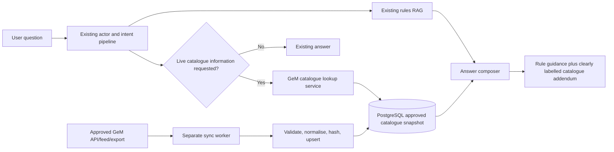

# GeM Public Catalogue Integration — Feasibility Audit

Date: 2 August 2026  
Scope: Read-only audit. No chatbot, retrieval, routing, model, database, or UI code was modified.

## Executive decision

**Production scraping decision: NO-GO until GeM provides written permission or an approved data interface.**

**Prototype decision: CONDITIONAL GO using a manually supplied/sample catalogue behind a disabled-by-default feature flag.**

**Preferred production decision: GO after GeM confirms an approved API, data feed, export, or partner integration and its rate, caching, attribution, and retention conditions.**

The proposed assistant architecture is technically sound, but the proposed source of truth is not yet established. Official material confirms that GeM maintains a dynamic catalogue and gives registered buyers catalogue search/compare capabilities. The audit did not find an officially documented public product-catalogue API or an openly licensed bulk product dataset. The available terms also prohibit unauthorised access or access beyond the authorised scope.

## Evidence

1. The official GeM buyer manual describes searching for a product/category and viewing matching products, specifications, and details. This confirms catalogue capability, but presents it as part of the buyer workflow rather than a public bulk-data contract: [GeM Buyer Manual](https://assets-bg.gem.gov.in/resources/pdf/buyer-user-manual.pdf).
2. The official GeM handbook describes the catalogue as dynamic and category-driven, with evolving technical parameters and continuously added categories. That makes fixed HTML scraping and field assumptions inherently unstable: [GeM Handbook](https://assets-bg.gem.gov.in/resources/pdf/GeM_handbook.pdf).
3. GeM's General Terms and Conditions prohibit illegal access, access to features not specifically authorised, and exceeding the scope of authorised access. They do not grant this chatbot a licence to bulk-copy, retain, or republish product catalogue data: [GeM GTC 4.0, Version 1.7](https://assets-bg.gem.gov.in/resources/upload/shared_doc/gtc/general-te-1675401798.pdf).
4. GeM's privacy policy prohibits attempts to gain unauthorised access and activity that interferes with the website or services. It also states that portal use is governed by GeM terms: [GeM Privacy Policy](https://static-sit.gem.gov.in/privacy-policy.html).
5. A public GeM bid-listing surface exists, but it is a bid listing and is not evidence of a public product catalogue/price API: [GeM Global Tender Bid Listing](https://bidplus-global.gem.gov.in/).
6. Searches of official GeM resources and India's Open Government Data portal did not identify a current bulk GeM product catalogue containing product-level prices, sellers, stock/availability, OEMs, and specifications.
7. Direct catalogue/portal access from the audit environment was refused, so `robots.txt`, public catalogue pagination, HTML stability, and any anonymous catalogue response could not be independently verified. This is an unresolved technical constraint, not evidence that scraping is permitted or prohibited.

## Data-field feasibility

| Proposed field | Feasibility | Main concern |
|---|---:|---|
| Product ID | Conditional | Identifier format and persistence are not documented for external use. |
| Product name | Likely | Naming may change and may not uniquely identify an offer. |
| Category | Likely | Category taxonomy and technical parameters are explicitly dynamic. |
| OEM/brand | Conditional | OEM, brand, reseller, and offer relationships must not be conflated. |
| Specifications | Conditional | Parameters vary by category and change over time; needs JSON storage plus a schema version. |
| Current price | High risk | Price may depend on quantity, delivery location, taxes, buyer context, offer status, and time. |
| Min/average/max price | High risk | Simple averages can be misleading across non-equivalent specifications and outliers. |
| Seller | High risk | Permission, retention, attribution, and personal/business-data rules must be confirmed. |
| Availability | Not established | "Listed", "active", "deliverable", and "available to this buyer/location" are different states. |
| GeM URL | Likely | Link stability and whether authentication is required must be tested. |
| Last updated | Not established | The portal may not expose a reliable record-level update timestamp. |
| Content hash | Feasible locally | Hashing detects a changed payload but cannot prove the underlying offer is current or complete. |

## Accuracy constraints for budget estimates

The assistant must not calculate `quantity × average catalogue price` without first creating a comparable product set. At minimum, comparable offers must share the material specification filters relevant to the commodity. For laptops this could include device type, processor class, memory, storage, operating system, display, warranty, and delivery conditions. A raw category average would be misleading.

Any displayed calculation must say:

> Indicative estimate based on the last approved GeM catalogue synchronization. It is not a quotation, sanctioned estimate, price-reasonableness determination, or procurement-method decision.

The response must also display the synchronization timestamp, number of comparable offers, filters used, and whether taxes/delivery are known.

## Local infrastructure readiness

- PostgreSQL 16 is installed and its Windows service is running locally on port `5433`.
- The `psql` executable exists under `C:\Program Files\PostgreSQL\16\bin`, but it is not on the current `PATH`.
- The project has no PostgreSQL driver, SQLAlchemy, Alembic, scheduler dependency, database model, migration, or `DATABASE_URL` configuration.
- The Rocky Linux deployment guide does not install or configure PostgreSQL.
- No database credential was inspected or used during this audit.

Therefore, PostgreSQL is available on the development machine but the application is **not database-ready**.

## Safest architecture



The sync worker must be a separate process/service. It must not run inside each Flask/Waitress web worker, because that can create duplicate schedules and overlapping syncs.

The existing RAG answer remains authoritative. Catalogue data is appended as decision support and must never change the selected actor, fine intent, retrieved rule context, or policy conclusion.

## Required source approval

Before implementation against live GeM data, obtain written answers from GeM for:

1. Is there an approved product-catalogue API, export, or data-sharing feed?
2. May a Chhattisgarh departmental chatbot periodically collect and cache catalogue records?
3. Which fields may be stored and republished: product, category, OEM, brand, seller, price, specifications, availability, URL, timestamps?
4. Are seller-level records permitted, or only aggregate/category data?
5. What authentication, rate limits, pagination, attribution, and retention rules apply?
6. May prices be used to calculate and display indicative min/average/max procurement estimates?
7. How should quantity, delivery location, taxes, and offer status be represented?
8. What deletion/update obligations apply when a listing changes or is removed?
9. Is automated public-page access permitted if no API is offered?

The official GeM support address published by the GeM LMS is `helpdesk-gem@gov.in`.

## Phased implementation plan

### Phase 0 — Permission and data contract

- Obtain the approved source and written usage conditions.
- Acquire a small representative sample for laptops, printers, chairs, scanners, desktops, biometric devices, and projectors.
- Freeze the field definitions and clarify price/availability semantics.
- Exit criterion: a documented source contract and sample payload.

### Phase 1 — Isolated database foundation

- Add the PostgreSQL driver, SQLAlchemy, and Alembic.
- Add configuration through environment variables only.
- Create tables for source records, normalised products/offers, categories, brands/OEMs, sync runs, and sync errors.
- Use an immutable raw-payload hash plus source update identifier/timestamp where provided.
- Add database and migration tests.
- Keep the feature flag disabled.

### Phase 2 — Approved ingestion adapter

- Create a provider interface; the first provider consumes only the approved API/feed/export.
- Validate payloads, rate-limit calls, retry transient errors, and stop on authentication/contract errors.
- Upsert new/changed records and mark missing records stale rather than immediately deleting them.
- Run the worker through a single scheduler/service with an advisory lock.
- Record counts, duration, source version, errors, and last successful sync.

### Phase 3 — Catalogue lookup and analytics

- Reuse the existing commodity extraction initially; add quantity extraction as an isolated helper.
- Map user commodities to approved GeM categories through a reviewed alias table.
- Filter to comparable offers before calculating statistics.
- Return typed lookup results with timestamp, filters, sample size, min/median/average/max, OEM summary, and limitations.
- Prefer median and trimmed aggregates over a raw average where appropriate.

### Phase 4 — Answer composition

- Add a post-RAG catalogue addendum behind a feature flag.
- Trigger it only for explicit availability, catalogue, OEM, or indicative-budget questions, or when quantity plus commodity is present and the user asks for an estimate.
- Never overwrite or reinterpret the RAG policy answer.
- If catalogue lookup fails or is stale, return the original RAG answer unchanged with a short catalogue-unavailable notice.

### Phase 5 — UI

- Render availability, comparable-offer count, OEM summary, price distribution, timestamp, and disclaimer as separate tables/cards.
- Link to the official GeM page where the approved interface provides a stable URL.
- Visually separate rule sources from catalogue data sources.

### Phase 6 — Release validation

- Run existing actor, fine-intent, retrieval, answer, leakage, fallback, and latency suites unchanged.
- Add catalogue tests for quantity extraction, category mapping, stale data, zero results, incomparable products, outliers, sync failure, duplicate records, partial updates, and feature-disabled behaviour.
- Require zero change to answers when the feature flag is disabled.

## Minimum configuration contract

```text
GEM_CATALOG_ENABLED=false
GEM_CATALOG_PROVIDER=sample|approved_api|approved_feed
GEM_CATALOG_SYNC_SCHEDULE=0 2 * * *
GEM_CATALOG_MAX_AGE_HOURS=36
GEM_CATALOG_REQUESTS_PER_MINUTE=<approved value>
DATABASE_URL=postgresql+psycopg://<user>:<password>@<host>:<port>/<database>
```

Credentials and access tokens must never appear in source code, prompts, logs, diagnostics, or browser responses.

## Recommended next action

Do **not** build a GeM web scraper yet. Send the access/data-use questions above to GeM and request an approved catalogue integration method.

While waiting for that approval, the safe next engineering step is Phase 1 using a versioned sample catalogue and `GEM_CATALOG_ENABLED=false`. This proves database, incremental hashing, lookup, calculation, and regression isolation without accessing or republishing live GeM data.
